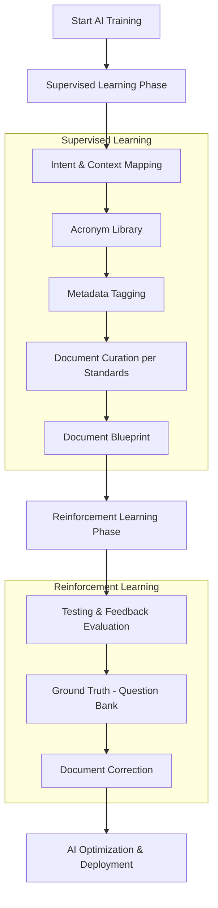

# AI Training Process Flow

## You (2025-02-11T19:12:18.464042+00:00)

Create a flow chart using this information

___

Process Flow Based on the AI Assistant Training Methods
Step 1: Supervised Learning Phase
Intent & Context Mapping

Define how the AI understands user queries.
Teach the AI to identify the meaning behind different types of questions.
Acronym Library

Build a database of industry-specific acronyms.
Train the AI to recognize and decode acronyms in user queries.
Metadata Tagging

Assign metadata to documents for better classification.
Train the AI to map queries to relevant documents based on metadata.
Document Curation per Standards

Ensure documents follow predefined quality and formatting standards.
Train AI to extract relevant information efficiently.
Document Blueprint

Establish a structured framework for tracking and organizing documents.
Implement a governance mechanism for document management.
Step 2: Reinforcement Learning Phase
Testing & Feedback Evaluation

Analyze AI performance on real queries.
Identify gaps and areas needing corrective action.
Ground Truth (Question Bank)

Compare AI-generated responses against a set of validated correct answers.
Adjust AI behavior based on discrepancies.
Document Correction

Continuously update documents with accurate and latest information.
Ensure AI refers to the most relevant and up-to-date data.
Additional Insights from the Image
AI Training Approach: The training process follows a structured progression from Supervised Learning to Reinforcement Learning to ensure continuous improvement.
Analogy Used: Supervised learning is compared to teaching a child by showing labeled images, while reinforcement learning is likened to conducting a test to identify weaknesses.
Dual Strategy for Optimization: The process involves both preemptive training (Supervised Learning) and post-training refinement (Reinforcement Learning).
Standardization & Governance: The emphasis on document curation and blueprinting suggests a focus on consistent and structured knowledge management.
Iterative Improvement Cycle: The model is not static—it continuously evolves through testing, feedback, and document updates.

## ChatGPT (2025-02-11T19:12:21.134491+00:00)

{"content_type": "code", "language": "json", "response_format_name": null, "text": "{\"file\": \"flowchart.md\"}"}

## ChatGPT (2025-02-11T19:13:54.420678+00:00)

Here's a flowchart representing the AI assistant training process, structured into two main phases: **Supervised Learning** and **Reinforcement Learning**.  

### **Flowchart Summary**
1. **Supervised Learning Phase**
   - Intent & Context Mapping  
   - Acronym Library  
   - Metadata Tagging  
   - Document Curation  
   - Document Blueprint  

2. **Reinforcement Learning Phase**
   - Testing & Feedback Evaluation  
   - Ground Truth (Question Bank)  
   - Document Correction  

Each step is connected sequentially to show the AI's training progression.  

---

```mermaid
flowchart TD
    A[Start AI Training] --> B[Supervised Learning Phase]

    subgraph Supervised Learning
        B1[Intent & Context Mapping]
        B2[Acronym Library]
        B3[Metadata Tagging]
        B4[Document Curation per Standards]
        B5[Document Blueprint]
    end

    B --> B1 --> B2 --> B3 --> B4 --> B5 --> C[Reinforcement Learning Phase]

    subgraph Reinforcement Learning
        C1[Testing & Feedback Evaluation]
        C2[Ground Truth (Question Bank)]
        C3[Document Correction]
    end

    C --> C1 --> C2 --> C3 --> D[AI Optimization & Deployment]
```

---

Now, I'll render the diagram to confirm its correctness.

## ChatGPT (2025-02-11T19:13:54.420737+00:00)

{"content_type": "code", "language": "json", "response_format_name": null, "text": "{\"mermaidCode\": \"flowchart TD\\n    A[Start AI Training] --> B[Supervised Learning Phase]\\n\\n    subgraph Supervised Learning\\n        B1[Intent & Context Mapping]\\n        B2[Acronym Library]\\n        B3[Metadata Tagging]\\n        B4[Document Curation per Standards]\\n        B5[Document Blueprint]\\n    end\\n\\n    B --> B1 --> B2 --> B3 --> B4 --> B5 --> C[Reinforcement Learning Phase]\\n\\n    subgraph Reinforcement Learning\\n        C1[Testing & Feedback Evaluation]\\n        C2[Ground Truth (Question Bank)]\\n        C3[Document Correction]\\n    end\\n\\n    C --> C1 --> C2 --> C3 --> D[AI Optimization & Deployment]\"}"}

## ChatGPT (2025-02-11T19:13:54.420866+00:00)

There was an error in rendering the diagram due to the parentheses in `"Ground Truth (Question Bank)"`. I'll fix it and try again.  

### **Updated Diagram Code** (Fixed issue with parentheses)

I'll render it again now.

## ChatGPT (2025-02-11T19:13:54.420924+00:00)

{"content_type": "code", "language": "json", "response_format_name": null, "text": "{\"mermaidCode\": \"flowchart TD\\n    A[Start AI Training] --> B[Supervised Learning Phase]\\n\\n    subgraph Supervised Learning\\n        B1[Intent & Context Mapping]\\n        B2[Acronym Library]\\n        B3[Metadata Tagging]\\n        B4[Document Curation per Standards]\\n        B5[Document Blueprint]\\n    end\\n\\n    B --> B1 --> B2 --> B3 --> B4 --> B5 --> C[Reinforcement Learning Phase]\\n\\n    subgraph Reinforcement Learning\\n        C1[Testing & Feedback Evaluation]\\n        C2[Ground Truth - Question Bank]\\n        C3[Document Correction]\\n    end\\n\\n    C --> C1 --> C2 --> C3 --> D[AI Optimization & Deployment]\"}"}

## ChatGPT (2025-02-11T19:13:54.421035+00:00)

Here is your AI training process flowchart:


You can edit and save this diagram on the [MermaidChart editor](https://www.mermaidchart.com/app/mermaid-chart-save/2025-02-11/33afe8ce-b5b4-40a2-83b8-610451a08f27). Let me know if you need any modifications! 🚀

